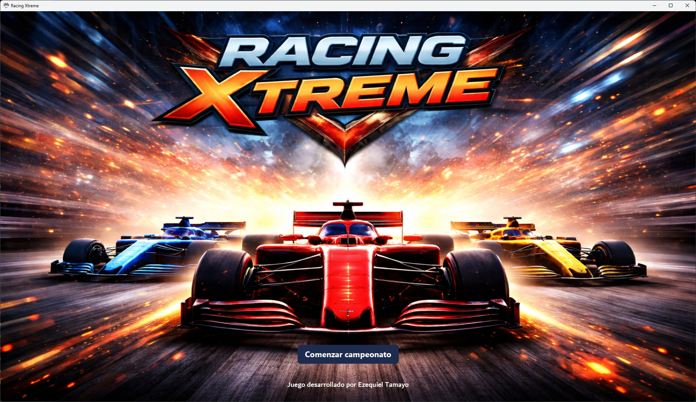
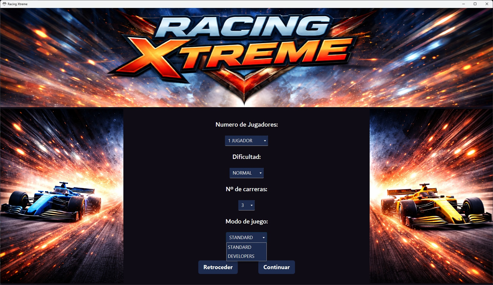
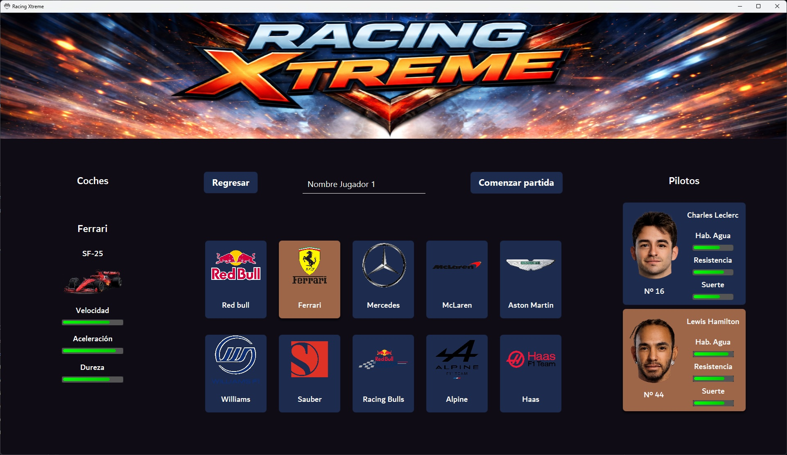
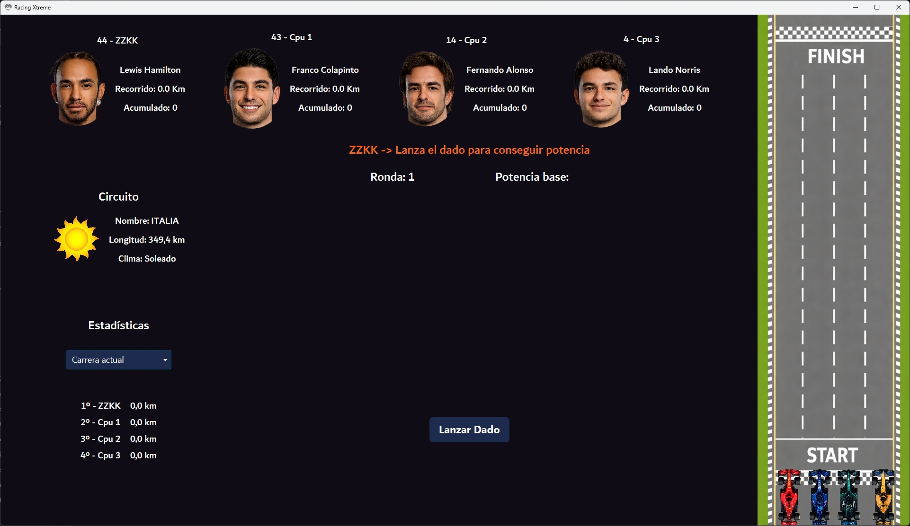
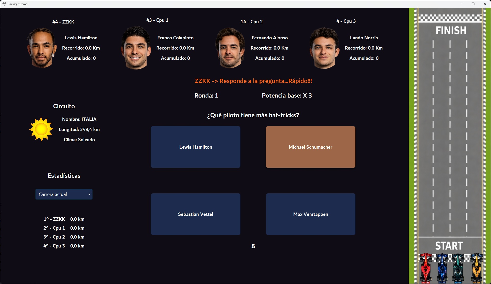
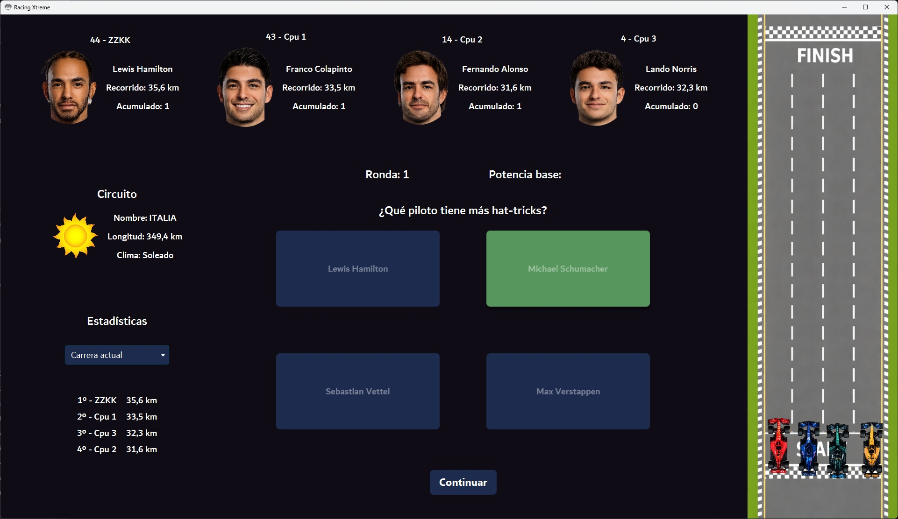

# Racing Xtreme - Juego de Mesa de Fórmula 1

Juego de mesa digital de carreras de Fórmula 1 desarrollado en Java con JavaFX. Combina mecánicas de tablero (tirada de dado, avance por circuito) con preguntas de trivia, gestión de equipos y pilotos reales con estadísticas propias, clima dinámico y modo multijugador con oponentes controlados por CPU.

---

## Capturas del Juego








---

## Funcionalidades y Mecánicas de Juego

- **Selección de equipo y piloto:** el jugador elige entre 10 escuderías reales de F1 (Red Bull, Ferrari, Mercedes, McLaren, Aston Martin, Williams, Sauber, Racing Bulls, Alpine, Haas), cada una con su coche y dos pilotos con estadísticas propias (habilidad en agua, resistencia, suerte).
- **Estadísticas de coche y piloto:** cada coche tiene velocidad, aceleración y dureza; cada piloto suma sus propias habilidades, visualizadas con barras de progreso en la interfaz.
- **Modo multijugador local:** varios jugadores humanos seleccionan equipo y piloto por turnos; las plazas restantes se rellenan automáticamente con **pilotos CPU** aleatorios (evitando duplicados).
- **Sistema de carreras por rondas:** cada `Race` genera un circuito aleatorio (15 posibles, entre Francia, Alemania, Italia, Brasil, etc.) con una longitud aleatoria y un clima aleatorio (soleado o lluvia) que afecta a la partida.
- **Mecánica de dado:** clase `Cube` con animación de tirada (imágenes de "giro" y resultado) para determinar el avance de cada jugador.
- **Preguntas de trivia:** sistema de `Question` y `Answer` que combina el azar del dado con preguntas de conocimiento, aportando un combo (`combo`) y puntuación total al piloto que responde correctamente.
- **Sistema de audio dinámico:** `AudioManager` (Singleton) gestiona la música de fondo, sonidos aleatorios de carrera (6 variantes) y un sonido de victoria distinto, controlando el ciclo de reproducción con `MediaPlayer` de JavaFX.
- **Modos y dificultad configurables:** selección de dificultad (`FÁCIL`, `NORMAL`, `DIFÍCIL`, `EXTREMO`) y de estilo de juego (`STANDARD`, `DEVELOPERS`).

---

## Tecnologías y Arquitectura

- **Java + JavaFX:** interfaz gráfica de escritorio con componentes dinámicos generados por código (`GridPane`, `VBox`, `HBox`, `ProgressBar`, `ImageView`).
- **Patrón Singleton:** `Championship` y `AudioManager` centralizan el estado global de la partida y de la reproducción de audio en una única instancia.
- **Enums internos:** `Circuit`, `Weather` y `GameStyle` usan `enum` privados para controlar de forma segura los valores posibles de circuito, clima y modo de juego.
- **Generación dinámica de UI:** `SelectTeamController` construye tarjetas de equipo y piloto por código en tiempo de ejecución, con eventos de clic (`setOnMouseClicked`) para la selección interactiva.
- **JavaFX Media API:** reproducción de música y efectos de sonido mediante `Media` y `MediaPlayer`.
- **Colecciones y control de duplicados:** uso de `HashSet<Integer>` para IDs usados y comprobación de pilotos ya seleccionados entre jugadores.

---

## Modelo de Dominio

| Clase | Responsabilidad |
|---|---|
| `Team` | Escudería, logo y coche/pilotos asociados |
| `Car` | Estadísticas del vehículo (velocidad, aceleración, dureza) y kilómetros recorridos |
| `Driver` | Piloto con estadísticas propias, coche asignado y puntuación por carrera |
| `Race` | Una carrera concreta: circuito, clima, lista de pilotos y ronda actual |
| `Championship` | Estado global de la partida: dificultad, modo, número de jugadores y carreras (Singleton) |
| `Circuit` / `Weather` | Generación aleatoria de circuito y condición climática por carrera |
| `Cube` | Lógica y assets visuales de la tirada de dado |
| `Question` / `Answer` | Banco de preguntas de trivia con respuestas correctas/incorrectas |
| `AudioManager` | Gestión centralizada de música y efectos de sonido (Singleton) |

---

## Estructura del Proyecto

```text
src/main/java/org/zeki/racingxtreme/
├── model/         # Team, Car, Driver, Race, Championship, Circuit, Weather, Cube, Question, Answer, AudioManager
├── controller/    # SelectTeamController y demás controladores FXML
└── util/          # Path, SceneHelper
```

---

## Cómo ejecutar el proyecto

```bash
git clone https://github.com/TamezeDev/racing-xtreme.git
```

Ábrelo con un IDE compatible con JavaFX (IntelliJ IDEA recomendado). Requiere el módulo `javafx.media` configurado en el `classpath`/`module-path` para la reproducción de audio.

Puedes descargar la version de escritorio para Windows y lanzar el ejecutable directamente
[Descarga RacingXtreme](https://drive.google.com/file/d/1iAZEfXIXOPVEdyW03lEZAmiivQ2OJHV-/view?usp=sharing)
